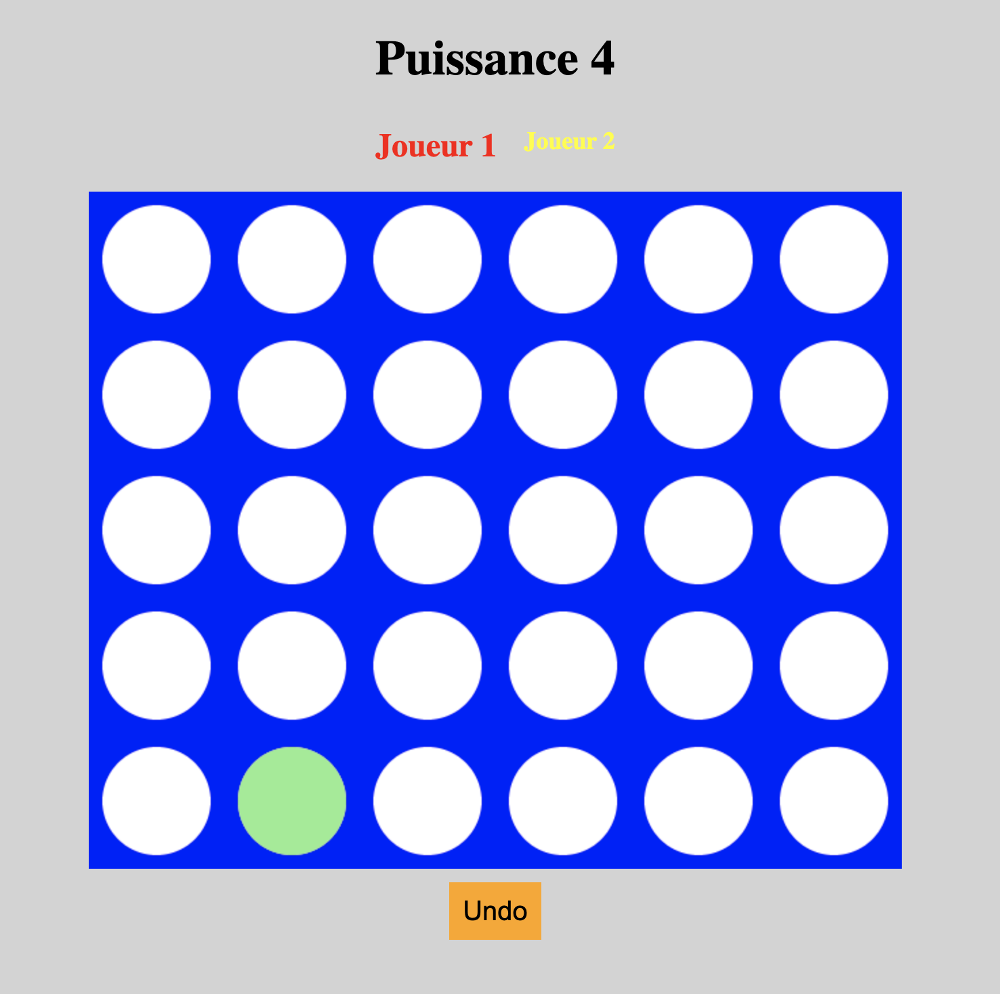

# Connect Four Plugin


A small vanilla JavaScript plugin so that you can insert a Connect Four game to your html page. Made during a sunny afternoon this july.

### Things I learned making this project
- Basic 2D array logic
- HTML Canvas manipulation
- DOM Events handling

## Installation
Clone the repo to get started.

For a div containing a canvas with these specific IDs
```html
    <div id="game-container">
        <canvas id="puissance4"></canvas>
    </div>
```

Link the "puissance4.js" file and "style.css" file with your HTML.


Write this JS in your HTML file or in another linked JS script.
```js
import { Game } from "./puissance4.js";
let players = [
  { number: 1, color: "red" },
  { number: 2, color: "yellow" },
];
let rows = 5;
let columns = 6;
let game = new Game(rows, columns, players, "puissance4");
```

You can add an remove players to play the connect four with more than 2 players, modify their color with CSS compatible color strings and you can change the number of rows and columns of the grid.
An action can be undone upon clicking the "Undo" button.
